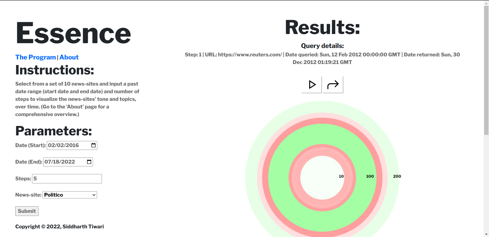
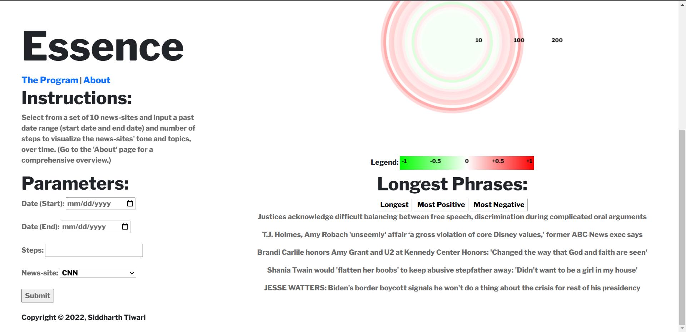

# Essence
## The Essence of Digital News Media: A Dynamic, Longitudinal Visualization of Sentiment and Topics

## Purpose + Inspiration
<p>Essence was made in response to a widespread belief that the news has become more negative and polarized, over time. While it's easy to agree with those around us, how exactly can we visualize this, in one place? In a way that allows us to experience the shift in tone, over time?</p>
<p>Drawing inspiration from Harvard's own <a href="http://www.fernandaviegas.com/">Dr. Fernanda Viegas</a> and her data-driven, dynamic, artful visualizations, Essence scrapes and analyzes the tone of newssites given a historical date range to produce a bulls-eye visualization to produce insightful slices of internet history.</p>
            
## Using Essence
<p>First, select from a set of 10 news-sites and input a past date range (start date and end date) and number of steps. Then an animation presenting both the bulls-eye animation and longest phrases will play.</p> 
<h5>The bulls-eye animation (pictured on the left panel), depicts two variables: the tone and length of a phrase; the radius of a ring within bulls-eye corresponds to the length of the phrase and the color of the ring reflects the positivity and negativity of the phrase.</h5> 
<p>To make the data simultaneously quantifiable and immersive, markers for 10, 100, and 200 characters are depicted on the bullseye visualization. Underneath the visualization is a legend relating the colors to their corresponding positivity and negativities (+1, green is 'most positive'; 0, white, is neutral; -1, red is 'least positive').</p>
<p>After the animation ends, you have the option to replay the animation by pressing the 'play' button or 'stepping' through the different animations, one at a time. While stepping through the animation, in order to relate the visualization to actual scraped text from the website, the user can see the five longest phrases from a given scrape, five most positive phrases, and five most negative phrases.</p>
<p>Given that this program uses open-source data from historically-formatted newssites (often with paywalls, as well), certain queries may, well, fail due to a lack of proper data. In this case, change the query date or/and the newssite in order to produce a new query.</p>

## Video


## Files
* `cs50-final-proj/`
    * `README.md`: Readme doc
    * `DESIGN.md`: Design doc
    * `requirements.txt`: Requirements/dependencies for running Essence
    * `app.py`: Application routes, which contain user input processing and the corresponding response
    * `helpers.py`: Helper functions used for interacting with APIs, performing text processing and sentiment analysis, and error handling
    * `templates/`
        * `index.html`: The Program
        * `about.html`: About Page
        * `static/`
            * `scripts.js`: Dynamic front-end functionality (code for the visualization, user-application interactions)
            * `styles.css`: CSS Styling
            * `favicon.png`, `legend.png`, `emotionalismblog.png`: Images used in various parts of the application


## Languages, Packages, APIs, Imports
* Frontend: HTML, CSS, JavaScript, Bootstrap, Google Fonts/Icons
* Backend: Python, Flask, Wayback Machine, BeautifulSoup, NLTK SentimentIntensityAnalyser - VADER Analyzer

## Getting started
1. Clone this repository (or download zip file)
```
git clone https://github.com/siddharth-r-tiwari/cs50-final-proj.git
```
2. Go to the app directory
```
cd path/to/cs50-final-proj
```
3. Create and activate your virtual environment (optional but recommended!)
    * macOS/Linux: 
    ```
    python3 -m venv venv
    . venv/bin/activate
    ```
    * Windows:
    ```
    py -3 -m venv venv
    venv\Scripts\activate
    ```

If this works, your command line should now have `(venv)` in front of each line.

4. Install the app requirements
```
pip install -r requirements.txt
```
5. Run the app!
```
export FLASK_APP=app
python3 -m flask run
```

## Screenshots
Sample views of the application:


